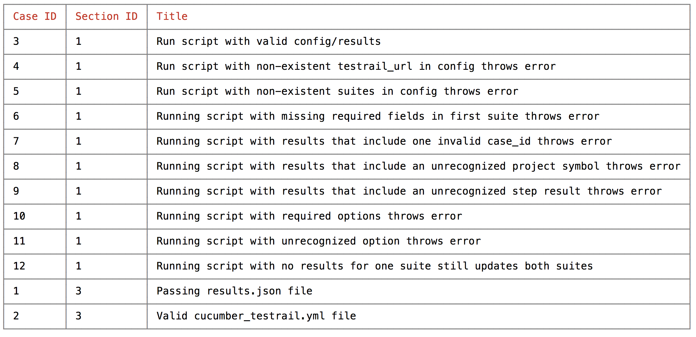

## Frequently Asked Questions

### How do I find my scenario_id?

Unfortunately, the Section ID of the Suites aren't exposed on the UI according to [this](https://discuss.gurock.com/t/how-to-get-the-section-id-of-the-test-suite/2871/5) thread.

As a workaround, CucumberTestrail supports a 'write' option that will return all the passed suite's cases with their section and case ids in a table.
In order to run the module in write mode, you will need to run it with the following options:

```
cucumber-testrail -c [your config file].yml
                  -w [the project symbol you would like the table for]
                  -u [your testrail username]
                  -p [your testrail password]
```



### How do I set up nightly runs and only update cucumber_testrail then?

This repository serves as a simple example to run the tests on every merge to master.
However, you may find running your test suite every night to be more valuable to you and your team.

If so, read the [CircleCI Documentation](https://circleci.com/docs/nightly-builds/) about setting up nightly builds.

Once you have it set up, you can update TestRail only if your nightly flag is on.
