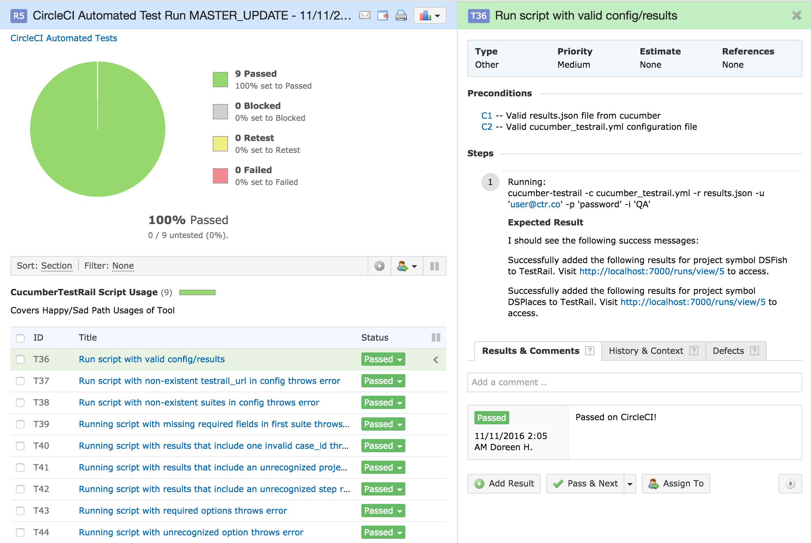
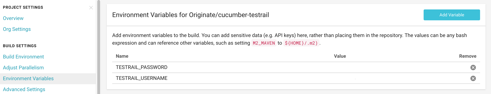

# Cucumber TestRail

Portal for Displaying Cucumber Results from CircleCI on TestRail!



## Setup

Preconditions

* [Cucumber](https://cucumber.io/docs#cucumber-implementations)
* [CircleCI](https://circleci.com/dashboard)
* [TestRail](http://www.gurock.com/testrail/)

Setup on TestRail
--

* Create New Project and enter project overview. The last number in the resulting url is your *project_id*
* Navigate to *Test Cases* tab
* Generate a new section and add test cases for your suite
* Navigate to *Test Runs & Results* tab
* Click on *Add Test Plan* Button
* Give your test plan a name and click *Add Test Plan*. The last number in the resulting url is your *testplan_id*

Setup on CircleCI
--

* Enable CircleCI builds for your repository
* Add your username and password as environment variables in the CircleCI dashboard's project settings



Setup on Your Project
--

* Add a `cucumber_testrail.yml` file to your root directory containing the following information:
  ```
  testrail_url: "https://yourtestrailurlhere.testrail.net/index.php?"

  suites:

    - suite:
        project_id: 1
        project_symbol: 'SYM'
        suite_id: (optional) 1
        section_id: (optional) [your section_id (not exposed on the UI but is sequential so starts with 1)]
        testplan_id: [your testplan_id]
  ```
  In this configuration, you will have one suite. Tags with the SYM symbol in your cucumber tags will correlate with this TestRail suite.
* In your project source, add the following `circle.yml` file:
  ```
  machine:
    node:
      version: 6.1.0

  test:

    pre:
      # create a new folder in circle's artifacts directory for our cucumber results
      - mkdir -p $CIRCLE_TEST_REPORTS/cucumber

    override:
      # run the cucumber tests and publish the json format to circle's artifacts
      - cucumber-js --format json:$CIRCLE_TEST_REPORTS/cucumber/tests.cucumber --format pretty

    post:
      - ./bin/publish_results
  ```
  This repository publishes results on every merge to master as a simple example. [Take a look.](https://github.com/Originate/cucumber-testrail/blob/master/bin/publish_results)
  If you are interested in configuring nightly test runs, you can do that too! [Read the documentation.](https://circleci.com/docs/nightly-builds/)
* Add `bin/publish` or any subsitute that will define when the builds should publish results to testrail:
  ```
  ./node_modules/.bin/cucumber-testrail -c cucumber_testrail.yml -r $CIRCLE_TEST_REPORTS/cucumber/tests.cucumber -u $TESTRAIL_USERNAME -p $TESTRAIL_PASSWORD -i '[SOME MESSAGE]'
  ```
  Here, [SOME MESSAGE] could denote an environment or and action. You can remove that option if you don't need it.
* Write Cucumber Tests with proper TestRail tags!
  In order to add feature tests that correlate with the above sample suite, add the following tag to the top of your scenario:
  ```
    @TestRail-SYM-1
    Scenario: Logging in to the Application
  ```
  In this example, this scenario maps to case_id 1 from your SYM test suite
* Merge tests and watch the update!


